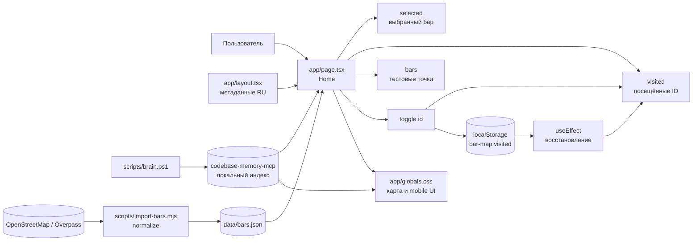

# Граф проекта

```mermaid
flowchart LR
  U[Пользователь] --> P[app/page.tsx\nHome]
  P --> S[selected\nвыбранный бар]
  P --> V[visited\nпосещённые ID]
  P --> B[bars\nтестовые точки]
  P --> T[toggle id]
  T --> V
  T --> L[(localStorage\nbar-map.visited)]
  L --> E[useEffect\nвосстановление]
  E --> V
  P --> C[app/globals.css\nкарта и mobile UI]
  M[app/layout.tsx\nметаданные RU] --> P
  X[scripts/brain.ps1] --> G[(codebase-memory-mcp\nлокальный индекс)]
  G --> P
  G --> C
  O[(OpenStreetMap / Overpass)] --> I[scripts/import-bars.mjs\nnormalize]
  I --> D[(data/bars.json)]
  D --> P
```

Обновлять граф нужно только при изменении модулей, публичных функций, маршрутов или постоянного хранилища.
